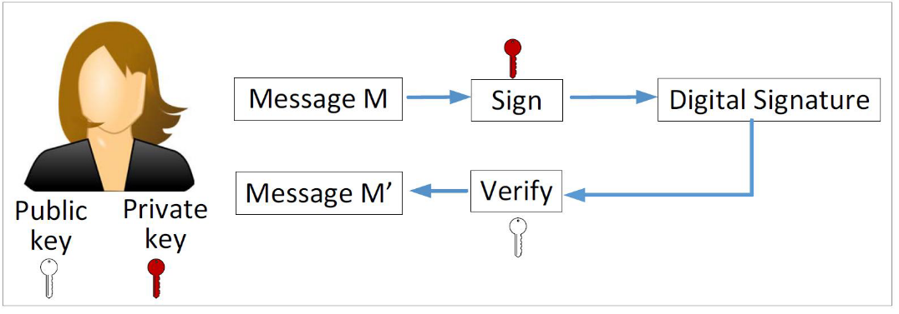

# protocol_analysis
# MADE BY CSQ
协议分析笔记
[TOC]

# 考点

csp网络窗口

形式化描述概念

含义方法类型

有限状态机、petri网（要会用）

- 概念
- 工作原理
- 模型表达
- 怎么描述协议
- petri如何工作

cpl基本含义和表现形式

协议分析：

课堂上讲到的协议分析工具、干什么的

数据链路层

- ppp和局域网
  - ppp协议是什么
  - 工作组成部分、该部分的作用
  - ppp协议帧

- 有限局域网：以太网
  - 以太网的地址的类型
  - 以太网数据错误判断原则
  - 以太网建设协议，碰撞检测，原理、算法

- 无线局域网：802.11
  - 为什么用CSMAC不要CSMACB
  - 隐藏站、暴露站

应用层

- http协议
  - URL格式、由哪部分组成
  - 请求和响应的所有命令（pop、get。。。有哪些、用途）信息、格式
  - 协议头、文本
  - 请求命令
  - 响应格式

pki对抗中间人攻击

- 会遇到什么情况
- X509证书内容
- 签名原理

**TLS协议**

- 是什么
- 工作过程
- 数据交换（为什么、交换了什么）

# 复习笔记

## 第一章 网络协议概述

### 1.1 基本概念

##### 网络协议

- 数据通信参与方在数据交互过程中共同遵循的一组规则（标准或约定） 

- 明确规定了通信中所交换的数据格式、含义及相关定时的技术细节

##### 三个要素

- 语法：数据与控制信息的结构或格式 
- 语义：语法中所定义结构的具体含义，需要发出何种控制信息，完成何种动作 以及做出何种响应等 
- 时序：事件实现顺序的详细说明、

##### 网络体系结构 

- 层和协议的集合为网络体系结构

##### 数据的层间传递

- ==对等实体== 
  - 不同机器上构成相同层次的实体称为对等实体
  - 数据并不是从一台机器的第n层直接传递到另一台机器的第n层 
- ==接口== 
  - 下层向上层提供的原语操作与服务
- ==服务==
  - 某一层向它的上层提供的一组原语（primitive）
- 协议通信 
  - 不同端上同一层次对等实体间的数据交换 
- 服务通信 
  - 同一端不同层次实体之间的数据交换 
- 服务访问点SAP 
  - 相邻层实体进行信息交互的地方
- 协议数据单元PDU 
- 服务数据单元SDU

##### 服务与协议的关系

- 协议是“水平”的，服务是“垂直”的

- 实体使用协议来实现其定义的服务
- 上层实体通过接口使用下层实体的服务
- 

##### 服务原语

- 典型服务：
  - ==面向连接传输服务（4原语）==
  - ==无连接传输服务（2原语）==
- ==原语（即操作）==
  - 告诉服务要执行某个动作或对等实体执行了何种动作
- 六个基本服务原语（系统调用）
  - 

### *1.2 OSI/RM参考模型

#### 物理层（Physical Layer）

- 物理层（Physical Layer）关注如何在通信信道上进行原始 开放系统—资源子网 比特的传输，构建物理链路。

#### 数据链路层（Data Link Layer）

- 数据链路层（Data Link Layer）基于不可靠的物理链路构建逻辑 开放系统—资源子网 链路，实现对**传输差错的检测及纠正、数据同步、流量控制等**
- 检测差错一般采用**循环冗余校验(CRC)**
- 数据同步通常使用封装成帧的方法：在发送方将数据分割成一定长 度并添加一些控制信息（地址、SDU数据类型、长度、差错检验系 列FCS）和首位定界符构造成一种特定格式的帧，然后按顺序发送 这些帧
- 如果要求提供可靠的数据链路，需要使用确认、序号和定时器等机 制对出错、丢失、重复的数据帧检测和纠正
- 流量控制用于避免收发进程处理速度不匹配而导致数据“淹没”的 问题，一般使用**滑动窗口（Slide Window）**策略解决
- 广播型的网络的数据链路层还需要解决多个通信节点对共享传输介 质的访问冲突问题

#### 网络层（Network Layer）

- 网络层（Network Layer）主要控制网络的运行，完成不同 开放系统—资源子网 网络主机间的数据传输
- 如果存在多条数据通路，如何将数据包从源端路由到接收方
- 路由可以是源节点确定，也可以是由网络选定；可以是针对 特定用户端静态指定的，也可以是网络中的中继系统根据网 络负载能力和当前状态随机选定
- 如何防止主机将过多的数据注入到网络造成网络拥堵，即拥塞问题
- 网络提供的服务质量（延迟、传输时延、抖动等）

#### 传输层 (Transport Layer)

- 传输层（Transport Layer）接收来自上一层的数据，有必 要的话会将较大的数据进行分割然后传递给网络层
- **传输层交换的数据单元是规定格式的报文段（segment）**
- 传输层需要决定向会话层提供哪种类型的服务，是可靠的（即数据 传输是按序的、无差错的、无丢失的、无乱序的），还是仅仅传输 独立的报文，不需要关注可靠性
- 服务的类型在进程初始化阶段就确定下来
- 传输层已经是到达了网络中进程数据传输的端点，**因此传输层的通信通常也称为端到端的通信**
- 传输层向上层屏蔽下面通信子网中的数据传输细节

#### 会话层 （Session Layer）

- 会话层（Session Layer）允许机器上的用户间建立会话关系
- 会话层按照在应用进程之间的约定，按照正确的顺序收发数据，进行各种形式的会话
  - 对话控制（记录该由谁来传递数据）
  - 令牌管理（禁止双方同时执行同一个关键操作）
  - 同步（在一个较长的传输过程中设置断点，以便系统崩溃后还能恢复到崩溃前的状态继续执行）
- 会话层可以允许用户利用一次会话在远端的分时系统上登录，或在轮胎机器间传输文件

#### 表示层（Presentation Layer）

- 表示层（  Presentation Layer）把数据转换为能与接收者的系统格式兼容并适合传输的格式
- 表示层关注所传送数据的语法和语义，通过定义一种抽象的数据结 构对数据进行统一编码，来屏蔽计算机和应用间的数据表示差异 
- 表示层可能提供数据加/解密、数据压缩/解压等
- 表示层为应用层所提供的服务包括：语法转换、语法选择和联接管 理等

#### 应用层（Application Layer）

- 应用层（Application Layer）是**应用软件与网络的接口**， 是OSI模型中的最高一层
- 应用层采用不同的应用协议来满足不同类型的应用需求
- 应用层中包含了若干独立的用户通用服务协议模块，为网络 用户之间的通信提供专用的服务
- 应用层并不是应用程序，**而是为应用程序提供服务**

### *1.3 TCP/IP参考模型

TCP/IP参考模型：ARPANET所采用 

- 以其中最主要的两个协议TCP/IP命名 
- Vint Cerf和Bob Kahn于1974年提出

网络接口层（host-to-network Layer）

- 描述与具体物理网络的接口，通过对类型扩展，使TCP/IP协议可以连接任何类型的物理网络

互联网层（Internet Layer）

- 允许主机将数据包注入网络，让这些数据包独立的传输至目的地， 并定义了数据包格式和协议（IPv4协议和IPv6协议）

传输层（Transport Layer）

- 允许源主机与目标主机上的对等实体，进行端到端的数据传输 
- TCP、UDP

应用层（Application Layer)

- 传输层之上的所有高层协议：DNS、HTTP、FTP、SMTP...

### *1.4 OSI模型与TCP/IP模型比较

### 1.5 ==因特网体系结构==

- 仍然以TCP/IP协议为核心 
- IP协议用来给各种不同的通信子网或局域网提供一个统一的互连平台 
- TCP协议则用来为应用程序提供端到端的通信和控制功能 
- 某些应用程序可以直接使用 IP 层，甚至直接使用最下面的网络接口层 
- 在网络接口层下面的物理网络由IEEE802委员会提出的局域网标准结构 具象化
- 将OSI**的会话层和表示层融入传输层当中**

## 第二章 网络协议分析

### 2.1 网络协议分析概述

- 分析网络协议的内在机制和实现机理。
- 网络协议分析的方法：
  - ==静态的代码分析==：通过阅读实际协议的实现代码理解其工作原理、数据结构、模块结构以及主要算法等内容
  - ==动态的流量分析==：通过软件工具从网络上捕获实时分组并分析，在一定程度上直观地了解协议的运行情况
    - 常用于网络的状态监控及故障诊断等。

### 2.2 GNS3简介

- GNS3 是一款图形化的网络模拟软件。
- 模拟器的核心是 Dynamips 程序，通过**构建一个虚拟的环境来运行真实的路由器网际操作系统**（Internet Operating Systems，IOS）。
- GNS3 是 Dynamips 的一种图形化前端工具，提供了友好的用户界面。
- 支持的网络设备包括：Cisco 路由器、（1700/2600/2691/3600/3725/3745/7200）、防火墙（PIX、ASA）、入侵检测系统（IDS）、交换机、Juniper 路由器、甚至能**连接到实际网络中，处理真实的网络流量**

#### CLI命令模式

- 用户模式：
  -  用户登录到交换机、路由器时，就处于用户模式，用户模式下只有少量命令可以使用。
- 特权模式：
  - 用户可以执行所有的 EXEC 命令。
  - EXEC 是 IOS 的命令解释器，用于解释和执行用户输入的
- 全局 / 接口配置模式：
  - 各种配置模式用于设置全局、接口或协议等的运行参数。
  - 参数可在特权模式下用 write 命令进行保存，当交换机或路由器重启后仍然有效。
- ROM 监控模式：
  - 用于设备恢复，当交换机或路由器由于 IOS 镜像或配置文件损坏而无法正常启动时，就进入 ROM monitor 模式。

### 2.3 Wireshark简介

- Wireshark 是一款开源的==分组嗅探工具==（Packet Sniffer）。
- 支持在多种网络接口上捕获分组
  - 如：Ethernet、PPP、SLIP、HDLC、WLAN、FDDI、ATM、Frame Relay、WLAN、Loopback、USB、Bluetooth、IrDA 等
  - 受操作系统支持的限制，==在不同系统上支持的网络接口类型==有所区别
- 支持上百种协议的分组结构分析

#### 分组嗅探器

- 分组嗅探器包括两部分：
- ==分组捕获器==（Packet Capture Library），用于复制从指定接口发送和接收的所有数据链路层帧；
- ==分组分析器==（Packet Analyzer），用于分析捕获的分组。
  - 如，显示分组的协议层次及其字段内容、追踪TCP流、统计协议分布、分组长度分布等。
- 从指定网络接口捕获分组时，需要将网络适配器（网卡）的工作模式设置为==混杂模式==（Promiscuous Mode），这样分组嗅探器就能复制到达该接口的（发送或接收）所有的数据链路层帧。

#### Wireshark 过滤器

有两种类型的过滤器（Filter）：

- 捕获过滤器（Capture Filter）：用于在捕获分组时设置过滤条件，只有满足条件的分组才被捕获。
- 显示过滤器（Display Filter）：用于在分组显示时设置过滤条件，只有满足条件的分组才被显示。
  - 显示过滤器并没有丢弃任何捕获的分组，只是不显示不满足条件的分组。
- 这两种过滤器的语法不同。

### 2.4 NS3简介

#### 概述

- NS3（Network Simulator 3）是一款开源的离散事件网络模拟器。
- 提供了一个分组网络运行的模型，可用于研究 Internet 协议是如何工作的。
- NS3 的仿真过程甚至可以集成真实的网络环境，处理真实的网络分组。
- NS3 是一款新的网络模拟工具，并不兼容 NS2。

#### 离散事件网络模拟

- **离散事件模拟**（Discrete Event Simulation，DES）：将一个系统中所有的变化抽象成一系列**按顺序的离散事件**，通过按时间顺序处理事件来模拟系统演进。
- 事件代表了某时刻系统状态的改变，系统的变化只能通过处理相应的事件来体现。
- 在相邻的事件间，系统状态维持前一事件发生后的状态不变：事件间的时间被“压缩”。
- NS3 中的事件：
  - **packet**：生成、发送、接收、丢弃...
  - **at-event**：仿真开始、结束；应用开始运行、结束...

- NS3 对网络组件的抽象来自于现实的网络模型，具有低耦合、高内聚的特点，其主要组件包括：
  - **节点**（Node）代表**基本的计算设备**。可看作一台空计算机，通过向计算机添加**应用**（Application）、**协议栈**（Protocol Stack）和**外设板卡**（Peripheral Cards）等组件可扩展其功能。
  - Internet 中的主机、服务器、路由器等设备都用节点来表示。
- **应用**（Application）
  - 代表现实网络中的**应用软件**。
  - **应用运行在节点上**（NS3 中没有操作系统的概念），生产或消费网络流量（分组），驱动网络模拟器运行。
  - 一个节点上可以运行多个应用。

- **网络设备**（Net Device）
  -  代表**网络接口卡及其驱动**。
  -  节点只有“安装”了网络设备后才能与其他节点通过信道通信。
  -  一个节点可以“安装”多个网络设备。
- **信道**（Channel）
  - 代表**通信网络**（如点到点网络、交换式以太网、无线网络等）。
  - **模拟信号在介质中的传输特性**, 如：传播时延、能量损耗、噪声干扰、误码率等。
  - 节点通过网络设备连接到信道上。
- **协议栈**（Protocol Stack）
  - 是对真实网络协议栈的抽象，**力求与真实网络协议兼容**。
  - 提供连接管理、传输控制、路由、地址管理等功能。
  - 应用组件通过**标准套接字 API** 与协议栈连接，而协议栈通过**协议复用**/**分用器**连接到多个网络设备，实现对多种网络设备的支持
- **分组**（Packet）
  - 代表协议栈各层的**协议数据单元**。
  - **与真实网络分组兼容**，可用于承载模拟数据或真实数据。

- **网络拓扑助手**（Topology Helper）
  - 仿真大规模网络时，需管理大量节点、网络设备、信道及其连接；
  - 需给大量节点安装协议栈、配置 IP 地址等信息。
  - NS3 提供了一组网络拓扑助手来简化这些工作。

## 第三章 数据链路层协议

### 3.1 数据链路层协议概述

- 成帧（Framing）

- 差错检测（Error Detection）
- 可靠交付（Reliable Delivery）
- 媒体访问（Medium Access）
- 流量控制（Flow Control）

### 3.2 PPP协议分析

#### PPP协议

##### PPP协议概述

- 现在全世界使用得最多的数据链路层协议是PPP（Point to Point =Protocol，点到点协议） 。

- PPP为点对点连接上传输多种协议的数据包提供了一种标准的方法，其最初的设计目的，是为两个对等结点之间的IP传输提供一种封装协议，除了IP以外，PPP还可以封装其它协议，包括Novell的IPX协议（Internetwork Packet Exchange，网间分组交换）等。 

- 帧格式；

  - LCP（Link Control Protocol，链路控制协议）；

    • 用于建立、配置和测试PPP链路

  - NCP（Network Control Protocol，网络控制协议）；

    - 用于建立、配置网络层协议
    - 对于IP网络，使用IPCP（IP Control Protocol，IP控制协议）协议。

  - PAP（Password Authentication Protocol，口令认证协议）和CHAP（Challenge Handshake Authentication Protocol，基于挑战的握手认证协议）

    - 用于认证，可选用。

- 协议特点：

  1. 简单
  2. 封装成帧
  3. 透明性
  4. 支持多种网络层协议和多种类型链路
  5. 差错检测
  6. 检测连接状态
  7. 最大传输单元
  8. 网络层协商

##### PPP协议的工作流程

在建立、保持和终止PPP链路的过程中，PPP链路需要经过5个阶段，除认证阶段外，其它4个阶段都是必要过程。 5个阶段如下：

1. 链路不可用阶段（Dead）
   - 链路状态的起始和终止点。
   - 当一个外部事件（例如检测到载波信号）指出物理层已经准备就绪时，进入“链路建立阶段”。

2. 链路建立阶段（Establish）
   - 通信双方使用LCP进行参数协商，配置链路。
   - 若协商成功，进入“认证阶段”，否则回到“链路不可用阶段”。
3. 认证阶段（Authenticate）
   - 认证不是必要过程。
   - 若发起方希望根据某一特定的认证协议进行认证，则发起方必须在“链路建立阶段”，声明要求使用的认证协议，常用的认证协议有PAP和CHAP。
   - 认证应尽可能在链路建立后立即进行，在认证完成之前，禁止从“认证阶段”进入到“网络层协议阶段”。若认证失败，则进入“链路终止阶段”。
4. 网络层协议阶段（Network）
   - 在传输数据之前，使用NCP协商双方通信时的参数。
   - 若协商成功，双方开始通信，否则进入“链路终止阶段”。
5. 链路终止阶段（Terminate）
   - 可以在任何时刻终止链路，PPP链路终止后，物理层链路仍然可用。
   - 通信方收到对等端发出的链路终止请求时，应给予确认。若载波信号丢失或停止时，回到“链路不可用阶段”。

##### PPP协议帧格式

- Flag字段为帧定界标志，用来标识PPP帧的开始与结束，长度为1字节，取值固定为0x7E。
- 若多个帧连续发送，可以省略到结束Flag字段，以提高对信道的利用率，减少开销。
- Address字段为地址字段，用来标识接收方的地址，长度为1字节，由于点到点链路的接收方是唯一的，故此字段取值固定为0xFF，表示只有对端才能接受到数据。
- Control字段为控制字段，长度为1字节，取值固定为0x03，表示无序号信息（Unnumbered Information）。
- Protocol字段为协议字段，用来标识PPP帧封装的协议数据类型，长度为2字节。此字段使PPP得以封装不同的协议。
- Information字段为信息字段，该字段长度不固定，最大长度等于MRU（Maximum Receive Unit）值，默认为1500字节。此字段存放承载的协议数据，包括LCP、NCP等。
- FCS（Frame Checksum）字段为帧校验和字段，用来检测PPP帧的完整性，长度为2字节。
- Flag字段为帧定界标志，用来标识PPP帧的开始与结束，长度为1字节，取值固定为0x7E

####  PPP协议的认证

##### CHAP协议认证流程和报文格式

- 概述
  - CHAP（Challenge Handshake Authentication Protocol，基于挑战的握手认证协议）
  - CHAP协议可以在链路建立和数据通信阶段多次使用，进行认证，同时安全性较高
  - 目前PPP协议的认证阶段多使用CHAP认证协议
- 认证流程（对应四种报文）
  - Challenge
  - Response
  - Success/Failure
- 认证过程中需配合事先协商好的算法，确认被认证方的身份
- 通常使用**MD5（Message Digest Algorithm 5）**作为其默认算法

### 3.3 以太网协议分析

#### 以太网概述

- 以太网的两个标准
  - DIX Ethernet V2 是世界上第一个局域网产品（以太网）的规约。
  - IEEE 的 802.3 标准
  - DIX Ethernet V2 标准与 IEEE 的 802.3 标准只有很小的差别，因此可以将 802.3 局域网简称为“以太网”。
  - 严格说来，“以太网”应当是指符合 DIX Ethernet V2 标准的局域网 
- 
- 由于 TCP/IP 体系经常使用的局域网是 DIX Ethernet V2 而不是802.3 标准中的几种局域网，因此现在 802 委员会制定的逻辑链路控制子层 LLC（即 802.2 标准）的作用已经不大了。
- 很多厂商生产的适配器上就仅装有 MAC 协议而没有 LLC 协议

#### 以太网帧格式

- 常用的以太网MAC帧格式有两种标准 ：
  - DIX Ethernet V2 标准
  - IEEE 的 802.3 标准
- 最常用的 MAC 帧是以太网 V2 的格式。

- 插入部分：

  - 为了达到比特同步，在传输媒体上实际传送的要比 MAC 帧还多 8 个字节 

- 目的地址字段 ：

  - 6 字节

- 源地址字段 ：

  - 6 字节

- 类型字段：

  - 用来标志上一层使用的是什么协议，以便把收到的 MAC 帧的数据上交给上一层的这个协议。IEEE802.3标准将其作为长度字段，用来指明在数据字段中所包含的字节数目。

- 数据字段：

  - 46 ～ 1500 字节
  - 正式名称是 MAC 客户数据字段
  - 最小长度 64 字节 − 18 字节的首部和尾部 = 数据字段的最小长度
  - 当数据字段的长度小于 46 字节时，应在数据字段的后面加入整数字节的填充字段，以保证以太网的 MAC 帧长不小于 64 字节。 

- FCS 字段：

  - 4 字节
  - 当传输媒体的误码率为 1*10^−8^ 时，MAC 子层可使未检测到的差错小于 10^−14^

  

- 以太网的帧间最小间隔

  - 帧间最小间隔为  4.8 微秒 ，相当于 96 bit 的发送时间。
  - 一个站在检测到总线开始空闲后，还要等待 4.8 微秒 才能再次发送数据。
  - 这样做是为了使刚刚收到数据帧的站的接收缓存来得及清理，做好接收下一帧的准备。

- 以太网中无效的 MAC 帧（对于检查出的无效 MAC 帧就简单地丢弃。以太网不负责重传丢弃的帧。)

  - 帧的长度不是整数个字节；
  - 用收到的帧检验序列 FCS 查出有差错；
  - 数据字段的长度不在 46 ～ 1500 字节之间；
  - MAC 帧长度不在 64 ～ 1518 字节之间。

  

#### MAC地址（以太网地址）

- 地址长度48位
- 通常以“:”隔开的6个十六进制数表示
- 08-00-20-0E-56-7D

#### CSMA/CD

最初的以太网是将许多计算机都连接到一根总线上。当初认为这样的连接方法既简单又可靠

**以太网采取的两种重要的措施**：

- 以太网发送的数据都使用曼彻斯特（Manchester）编码的信号。
  - 便于从收到的比特流中提取位同步信号（即时钟信号）。
- 载波监听多点接入/碰撞检测CSMA/CD 

**概述**：

- CSMA/CD 表示Carrier Sense Multiple Access with Collision Detection。
- “多点接入”表示许多计算机以多点接入的方式连接在一根总线上。
- “载波监听”是指每一个站在发送数据之前先要检测一下总线上是否有其他计算机在发送数据，如果有，则暂时不要发送数据，以免发生碰撞。
- 总线上并没有“载波”。因此，“载波监听”就是用电子技术检测总线上有没有其他计算机发送的数据信号。
- “碰撞检测”就是计算机边发送数据边检测信道上的信号电压大小。当几个站同时在总线上发送数据时，总线上的信号电压摆动值将会增大（互相叠加）。
- 当一个站检测到的信号电压摆动值超过一定的门限值时，就认为总线上至少有两个站同时在发送数据，表明产生了碰撞。
- 所谓“碰撞”就是发生了冲突。因此“碰撞检测”也称为“冲突检测”。
- 在发生碰撞时，总线上传输的信号产生了严重的失真，无法从中恢复出有用的信息来。
- 每一个正在发送数据的站，一旦发现总线上出现了碰撞，就要立即止发送，免得继续浪费网络资源，然后等待一段随机时间后再次发送。

**采用了载波监听后，为什么还会出现数据在总线上的碰撞呢？**

- 原因：电磁波在总线上的有限传播速率传播
- 当某个站监听到总线是空闲时，也可能总线并非真正是空闲的。
- A 向B 发出的信息，要经过一定的时间后才能传送到B。
- B 若在A 发送的信息到达B 之前发送自己的帧（因为这时B 的载波监听检测不到A 所发送的信息），则必然要在某个时间和A 发送的帧发生碰撞。
- 碰撞的结果是两个帧都变得无用。

- 传播时延对载波监听的影响

**争用期**

- 最先发送数据帧的站，在发送数据帧后至多经过时间2（两倍的端到端往返时延）就可知道发送的数据帧是否遭受了碰撞。
- 以太网的端到端往返时延2\tau称为争用期，或碰撞窗口
- 经过争用期这段时间还没有检测到碰撞，才能肯定这次发送不会发生碰撞
- 争用期的长度
  - 以太网取51.2 微秒（10的-6次方） 为争用期的长度。
  - 对于10 Mb/s 以太网，在争用期内可发送512 bit，即64 字节。
  - 以太网在发送数据时，若前64 字节没有发生冲突，则后续的数据就不会发生冲突。
- 以太网最短帧长
  - 如果发生冲突，就一定是在发送的前64 字节之内。
  - 由于一检测到冲突就立即中止发送，这时已经发送出去的数据一定小于64 字节。
  - 以太网规定了最短有效帧长为64 字节，凡长度小于64 字节的帧都是由于冲突而异常中止的无效帧。

**截断二进制指数退避算法**(truncated binary exponential backoff)

- 发生碰撞的站在停止发送数据后，要推迟（退避）一个随机时间才能再发送数据。
  - 基本退避时间取为争用期2t。
  - 从整数集合[0,1,…, (2k −1)]中随机地取出一个数，记为r。重传所需的时延就是r 倍的基本退避时间。
  - 参数k 按下面的公式计算：
  - k = Min[重传次数, 10]
  - 当k 小于等于10 时，参数k 等于重传次数。
  - 当重传达16 次仍不能成功时即丢弃该帧，并向高层报告。

**强化碰撞**

- 当发送数据的站一旦发现发生了碰撞时：
  - 立即停止发送数据；
  - 再继续发送若干比特的人为干扰信号(jamming signal)，以便让所有用户都知道现在已经发生了碰撞。

**人为干扰信号**

- B 也能够检测到冲突，并立即停止发送数据帧，接着就发送干扰信号。这里为了简单起见，只画出A 发送干扰信号的情况。
- 

**CSMA/CD 协议的要点：**

- 

### 3.4 IEEE 802.11协议分析

##### IEEE 802.11协议概述

无线通信技术是通信领域发展速度最快的技术之一，当前无线局域网（Wireless LAN）已经得到了广泛的应用。

**体系结构**

- 
- 

##### IEEE 802.11协议编址机制

IEEE 802.11 地址的四种情况

隐藏站问题：

解决方法：**CSMA/CA**

**工作流程**

采用CSMA/CA**的三个原因**

1. 站点若进行碰撞检测，就必须具备发送接收数据和检测接收碰撞信号的能力，会增加成本和带宽需求；
2. 存在隐藏站问题，碰撞可能无法检测；
3. 站点之间可能相距很远。由于信号衰减问题，某站点可能无法监听到另一站点发生的碰撞。

帧类型

- 管理帧用于站点和接入点之间的初始化；
- 控制帧用于信道接入和帧的确认；
- 数据帧用于携带数据和控制信息。

暴露站问题：

## 第七章 应用层协议

### 7.1 HTTP协议分析

#### HTTP概述

##### 万维网概述

- 万维网 WWW (World Wide Web)并非某种特殊的计算机网络。 
- 万维网是一个大规模的、联机式的信息储藏所。 
- 万维网用链接的方法能非常方便地从因特网上的一个站点访问另一个 站点，从而主动地按需获取丰富的信息。 
- 这种访问方式称为“链接”。

##### 超媒体与超文本

- 万维网是分布式超媒体(hypermedia)系统，它是超文本(hypertext) 系统的扩充。 
- 一个超文本由多个信息源链接成。利用一个链接可使用户找到另一个 文档。这些文档可以位于世界上任何一个接在因特网上的超文本系统 中。超文本是万维网的基础。 
- 超媒体与超文本的区别是文档内容不同。超文本文档仅包含文本信息， 而超媒体文档还包含其他表示方式的信息，如图形、图像、声音、动 画，甚至活动视频图像。

##### Web客户端和Web服务器

- 万维网以客户−服务器方式工作。
- 浏览器就是在用户计算机上的万维网客户程序。万维网文档所驻留的 计算机则运行服务器程序，因此这个计算机也称为万维网服务器。 
- 客户程序向服务器程序发出请求，服务器程序向客户程序送回客户所 要的万维网文档。
- 在一个客户程序主窗口上显示出的万维网文档称为页面(page)。

##### 统一资源定位符 URL

- 统一资源定位符 URL 是对可以从因特网上得到的资源的位置和访问 方法的一种简洁的表示。
- URL 给资源的位置提供一种抽象的识别方法，并用这种方法给资源定位。 
- 只要能够对资源定位，系统就可以对资源进行各种操作，如存取、更 新、替换和查找其属性。 
- URL 相当于一个文件名在网络范围的扩展。因此 URL 是与因特网相连的机器上的任何可访问对象的一个指针。 
- 一般形式：
  - 由以冒号隔开的两大部分组成，并且在 URL 中的字符对大写或小写 没有要求
  - URL 的一般形式是：
  - <协议>://<主机>:<端口>/<路径> 
  - 协议：
    - ftp —— 文件传送协议 FTP
    - http —— 超文本传送协议 HTTP
    - News —— USENET 新闻
  - <主机> 是存放资源的主机 在因特网中的域名
    - <主机> 是存放资源的主机 在因特网中的域名
  - <端口>/<路径>
    -  有时可省略

##### HTTP简介

使用何种协议实现万维网上各种超链的数据传输？

在万维网客户程序与万维网服务器程序之间进行交互所使用的协议， 是超文本传送协议 ==HTTP (HyperText Transfer Protocol)。==

HTTP 是一个应用层协议，它使用 TCP 连接进行可靠的传送。

##### 使用 HTTP 的 URL

- http ://<主机>:<端口>/<路径>
  - "http"：表示使用http协议
  - "://"：规定格式
  - "<主机>："：写主机的域名
  - "<端口>/"：HTTP 的默认端口号是 80，通常可省略
  - "<路径>"：若再省略文件的<路径>项，则 URL 就指到 因特网上的某个主页(home page)。

#### HTTP事务

- 为了使超文本的链接能够高效率地完成，需要用 HTTP 协议来传送一切必须的信息。
- 从层次的角度看，HTTP 是面向事务的(transactionoriented)应用层协议，它是万维网上能够可靠地交换文 件（包括文本、声音、图像等各种多媒体文件）的重要基础。
- 

##### 用户点击鼠标后所发生的事件

1. 浏览器分析超链指向页面的 URL。 
2. 浏览器向 DNS 请求解析 www.xupt.edu.cn 的 IP 地址。
3. 域名系统 DNS 解析出西安邮电大学主页服务器的 IP 地址。
4. 浏览器与服务器建立 TCP 连接。
5. 浏览器发出取文件命令： GET /index.htm 。 
6. 服务器给出响应，把文件 index.htm 发给浏览器。
7. TCP 连接释放。
8. 浏览器显示“西安邮电大学主页”文件 index.htm 中的所有文本。

##### HTTP 的主要特点

- HTTP 是面向事务的客户服务器协议。 
- HTTP 1.0 协议是无状态的(stateless)。 
- HTTP 协议本身也是无连接的，虽然它使用了面向连接的 TCP 向上提 供的服务。

##### 有条件请求

- 客户可以在请求中增加条件。 
- 在条件满足时发送请求的Web页面，否则服务器将通知客户
  - 例：客户可以通过发送If-Modified-Since首部行来通知服务器只发送在指明时间点之后修改过的页面。

##### 请求一个万维网文档所需的时间

##### ==持续连接(persistent connection)==

- HTTP/1.1 协议使用持续连接。 
- 万维网服务器在发送响应后仍然在一段时间内保持这条连接，使同一 个客户（浏览器）和该服务器可以继续在这条连接上传送后续的 HTTP 请求报文和响应报文。 
- 这并不局限于传送同一个页面上链接的文档，而是只要这些文档都在同一个服务器上就行。
- 两种工作方式:
  - 非流水线方式：客户在收到前一个响应后才能发出下一个请求。这比 非持续连接的两倍 RTT 的开销节省了建立 TCP 连接所需的一个 RTT 时间。但服务器在发送完一个对象后，其 TCP 连接就处于空闲状态， 浪费了服务器资源。
  - 流水线方式：客户在收到 HTTP 的响应报文之前就能够接着发送新的 请求报文。一个接一个的请求报文到达服务器后，服务器就可连续发 回响应报文。使用流水线方式时，客户访问所有的对象只需花费一个 RTT时间，使 TCP 连接中的空闲时间减少，提高了下载文档效率。

#### HTTP请求报文

##### 请求报文的报文结构

- 请求报文由三个部分组成，即请求行、首部行和实体主体。
- 请求行
  - “方法”是面向对象技术中使用的专门名词。所谓“方法”就是对所请求的对象进行的操作，因此这些方法实际上也就是一些命令。因此，请求报文的类型是由它所采用的方法决定的。
  - 
  - “URL”是所请求的资源的 URL。
  - “版本”是 HTTP 的版本。
- 首部行
  - 在请求行之后，可以有零到多个请求首部（request header）行。 
  - 每个首部行是客户向服务器发送的附加信息。 
  - 每一个首部行由首部字段名、冒号、空格和首部值组成。
  - 
- 实体主体
  - 实体主体可以出现在请求报文中。 
  - 请求报文中的实体主体部分通常是一些需要发送的备注信息。

#### HTTP响应报文

、- 

- 响应报文也由三个部分组成，即状态行、首部行和实体主体。
- 状态行： 
  - 状态行包括三项内容，即 HTTP 的版本，状态码，以及 解释状态码的简单短语。
  - 状态码都是三位数字
    - 1xx 表示通知信息的，如请求收到了或正在进行处理。 
    - 2xx 表示成功，如接受或知道了。 
    - 3xx 表示重定向，表示要完成请求还必须采取进一步的行动。 
    - 4xx 表示客户的差错，如请求中有错误的语法或不能完成。 
    - 5xx 表示服务器的差错，如服务器失效无法完成请求
  - 状态码和状态短语：
    - 
    - 
- 首部行：
  - 在状态行之后，可以有零到多个响应首部行。 
  - 每个首部行是服务器向客户发送附加信息。 
  - 每一个首部行由首部字段名、冒号、空格和首部值组成。
  - 
- 实体主体：
  - 实体主体可以出现在响应报文中。 
  - 实体主体包含通常是一些需要发送的备注信息或从服务器向客户发送的文档。

## 第九章  网络协议设计技术

#### 差错控制（Error Control）

- 协议的差错控制功能负责差错的检测及恢复，来保证数据的可靠传输。
- 差错控制功能由发送方和接收方共同实现，用来防止丢失、重复和失序。
- 主要使用的技术手段包括：**序号、确认、定时器和重传。**
- 差错控制机制与下层提供的通道的性质有很大关系，下层提供的数据通道的可靠性越高，则上层协议需实现的差错控制机制越少

#### 流量控制（Flow control）

- 流量控制就是调整发送信息的速率，使得接受节点能够及时处理信息的一个过程。
- 流量控制的目的主要有以下两个：为了防止网络出现拥挤及死锁而采取的一种措施；使业务量均匀地分配给各个网络节点。
- 例如：滑动窗口流量控制机制

#### 拥塞控制（Congestion Control）

- 当通信子网负荷比较小时，网络的吞吐量（分组数/秒）随网络负荷（每个节点中分组的平均数）的增加而线性增加。
- 当网络负荷增加到某一值后，若网络吞吐量反而下降，则表征网络中出现了拥塞现象。
- 拥塞控制的主要功能是：
  - 防止网络因过载而引起吞吐量下降和迟延增加；
  - 避免死锁；
  - 在互相竞争的各用户之间公平地分配资源。

#### 差错检测技术

- 奇偶检验（parity check）
- - 用单个奇偶检验位（parity bit）可以检测出链路发生的单个比特差错。
  - 在偶检验方案中，发送方在发送d个比特时附加上1个检验比特，并使d+1个比特中1的总数为偶数。
  - 在奇检验方案中，选择检验比特值使1有奇数个。
  - 接收方通过对接收的d+1个比特中1的数目进行计数即可知道是否出现比特差错。
- 循环冗余检验（cyclic redundancy check，CRC）
  - CRC以有限域数学为理论基础，将要发送的比特序列认为系数是0和1的一个n次多项式，报文中的每个比特值为多项式中每一项的系数。
  - CRC编码操作如下：
    - 发送方和接收方必须协商一个除数G(x)，称为生成多项式（generator）。G(x)是一个k次幂的多项式；
    - 发送方对于一个给定n比特长的数据段M（x），要计算k位附加比特R（x），并将其加到数据段后面，得到n+k比特P（x）=M（x）*x^k^+R（x）（它对应一个二进制数）。附加比特R（x）是M（x）*x^k^除以G（x）所得到的余数。
    - 接收方用G（x）去除接收到的n+k比特。如果余数为非零，接收方就知道出现了差错；否则认为数据正确而接受它。

#### 流量控制技术的设计

- 停止等待协议
  - 在停止-等待（Stop-and-Wait）协议的控制之下（由接收方控制发送方的发送速率），发送方每发送完一帧就必须停下来，等待接收方的信息。
- 滑动窗口协议
  - 在滑动窗口协议中，对每一个要发送的帧进行编号，编号范围是从0到某个最大值。
  - 最大值通常是2^n^-1。
  - 在每一个帧中，设有序号字段，字段长度为n比特。
  - 在最简单的滑动窗口协议，即停止等待协议中，n=1，因为只需用到0和1两个序号。但是在复杂的协议中，则使用任意n值。
  - 在滑动窗口协议中，设置两个窗口
    - 发送窗口（sending window）
    - 接收窗口（receiving window）
  - 

## ==第十章 网络协议形式化描述技术==

### 1.网络协议形式化描述技术基本概念*

#### A 简介：

- 协议模型技术作为协议工程的核心技术之一，是协议工程的基础
- 形式化描述语言、协议正确性验证、协议自动化实现以及协议测试等都是以某种模型技术为基础的
- 协议形式化是指使用形式化描述技术贯穿于协议开发的各个阶段，使得协议的研究开发独立于非形式化的自然语言文本和最终实现代码，避免协议验证、测试的复杂性

#### B 基本概念：

- 自然语言进行协议描述
  -  优点：表达性强、可读性好、方便
  -  缺点：不严格、不精确、结构不好、没有描述标注和有二义性
  -  协议到协议实现需要手工进行，协议的实现、测试的自动化和协议验证难以实现
- 形式化描述技术
  - 能够提供严格的语法和语义定义，更准确、简明地描述协议特征，为协议开发提供坚实基础
  - 使用逻辑的方法不仅能提供无二义的描述，能够对描述进行形式分析，提高协议设计的可靠性和鲁棒性
  - 协议的研究开发独立于非形式化的自然语言文本和实现代码，避免协议验证的复杂性
  - 支持协议工程活动各个环节的自动化和实现，特别是协议综合、验证、自动实现和一致性测试，大大提高协议实现和维护的能力

#### C 形式化描述技术特征:

- 完整的语法和语义定义
- 体系结构、服务和协议的可表达性
- 协议重要特征的可分析性
- 支持复杂协议的管理
- 支持逐步求精的方法
- 支持实现独立性
- 支持协议生命周期的各个环节，包含验证、实现和测试
- 支持协议设计、验证、实现和维护过程的自动化或半自动化
- 能准确描述进程交互的各个原语

### 2.FSM （有限状态机）与网络协议形式化描述

#### 有限状态机：

- 有限状态集
- 输入集
- 状态转移规则集

#### 定义：

- 有限状态机可定义为一个五元组𝑀 =< 𝑄, Σ, 𝛿, 𝑞0, 𝐹 >

- Q为有限状态集，任一确定时刻，有限状态机只能处于一个确定状态
- Σ为输入集，任一确定时刻，有限状态机只能接收一个确定的输入 
- 𝛿: 𝑄 × Σ → 𝑄状态转移函数
- 𝑞0 ∈ 𝑄起始状态
- 𝐹 ⊆ 𝑄终点状态集合，状态机达到终点状态不能接收输入

#### 定义示例(1)

- An example：
  - State set = {q0, q1, q2}
  - Input set = {0, 1}
  - Output set = {y, n}
  - ——Transition=  Output
  - ​                              Next State
- 

- FSM可以定义为5元组M = (I, O, S， δ，λ)
  - I:输入符号的有限非空集
  - O:输出符号的有限非空集
  - S:状态的有限非空集
  - δ: S X I→S，状态转移函数
  - λ: S X I→O，输出函数
- 系统的状态数是有限的。否则，状态机称为图灵

#### 分类：

- 不同输出功能:
  - Mealy machine - λ: S X I - O [Mealy状态机]
  - Moore machine → λ: S → O [Moore状态机]
  - Mealy machine and Moore machine可以相互转换
- 是否确定过渡状态和输出:
  - DFSM：对于特定的输入和所有的状态，过渡状态和输出确定[确定有限状态机]
  - NFSM:   对于特定的输入和现有状态，转换的状态和输出是不确定的[非确定有限状态机]
- 

### 3.Petri网与网络协议形式化描述

- 是一种状态迁移模型，允许同时发生多个状态迁移，是一种并发
  模
- 定义
  - Petri网被定义为一个4元组(P, T, I, O)
  - P是位置的有限集合
  - I为输入函数，是迁移T到位置的映射
  - O为输入函数，是迁移T到位置的映射

#### Petri网的状态迁移：

- 状态迁移条件
  - 必须有一个或多个迁移满足迁移条件
  - 必须发生触发
- 迁移分类
  - 源迁移：无输入位置
  - 阱迁移：无输出位置
- 状态迁移分类
  - 顺序
  - 并发
  - 互斥
- 

### 4.SDL

## TLS协议

#### TLS概述

TLS (Transport Layer Security)是一个在两个通信应用程序之间提供安全通道的协议。

安全通道具有3个属性:

- 机密性:只有通道两端才能看到传输的数据的实际内容

- 完整性:通道可以检测到数据在传输过程中发生的任何变化。
- 身份验证:通道至少有一端需要进行身份验证，以便另一端知道与之通信的是谁。

#### TLS层

TLS位于传输层和应用层之间

- 未受保护的数据由应用层提供给TLS

- TLS处理加密、解密和完整性检查

- TLS将受保护的数据提供给传输层

#### TLS握手

在客户端和服务器能够安全通信之前，需要先设置几件事:

- 加密算法和密钥
- MAC算法
- 密钥交换算法

这些加密参数需要客户端和服务器达成一致

这是握手协议的主要目的

##### TLS握手协议

##### TLS握手时的网络流量

由于TLS运行在TCP之上，因此需要在握手协议之前建立TCP连接。在使用Wireshark捕获的TLS握手协议期间，客户端和服务器之间的数据包交换是这样的:

#### 证书验证

- 客户端首先对证书进行验证检查
  - 检查有效期、签名有效性等
  - 主机名和证书的通用名匹配
- 客户端需要有签名CA的公钥证书。

#### 密钥生成和交换

虽然公开密钥算法可以用于加密数据，但它比秘密密钥算法要昂贵得多。

- TLS使用PKI进行密钥交换。

- 在此之后，服务器端和客户端切换为秘钥加密算法

整个密钥生成过程包括三个步骤:

- 步骤1:生成pre-master secret
- 步骤2:生成master secret
- 步骤3:生成会话密钥

#### TLS数据传输	

- 一旦握手协议完成，客户端和服务器就可以开始交换数据。
- 使用记录传输数据。
- 每条记录包含一个头和一个负载

使用TLS记录协议发送数据

使用TLS记录协议接收数据

## Public Key Infrastructure

#### MITM攻击公钥密码系统：

##### 基本问题

- Bob无法判断他收到的公钥是否属于Alice。

解决方法:

- 寻找可信方验证身份
- 将身份绑定到证书中的公钥
- 证书不能被伪造或篡改(使用数字签名)

##### 数字签名

- 如果签名没有被篡改，M '将与M相同
- 只有Alice可以签名(她有私钥)
- 每个人都可以验证(公开密钥是公开的)

使用数字签名击败MITM攻击:

- Alice需要到一个受信任的团体去获得一个证书。
- 在验证Alice的身份后，受信任方颁发一个带有Alice名字和她的公钥的证书。
- Alice将整个证书发送给Bob。
- Bob使用受信任方的公钥验证证书。
- Bob现在知道了公钥的真正所有者。

------

#### PKI

- 证书颁发机构(CA):受信任的一方，负责验证用户的身份，然后将经过验证的身份绑定到公钥。

- 数字证书:证明里面包含的公钥确实属于文档中描述的身份的文件。-
  - X.509标准

##### X.509的例子

- 
- 
- CA的身份
- 证书拥有者的信息
- 证书拥有者的公钥
- CA的数字签名

#### 证书颁发机构和CA如何签署证书

##### CA的核心功能

- 验证主题
  - 确保**申请证书的人**拥有或代表主题字段中的**身份**。
- 签名数字证书
  - CA使用**其私钥**为证书生成**数字签名**。
  - 应用签名后，证书将不可修改。
  - 任何人都可以使用**CA的公钥验证签名**。

##### 如何成为CA？

- CA如何颁发证书
- 如何从CA获得证书
- 如何使用证书设置web服务器

##### CA设置

- 我们的CA将被称为ModelCA
- 我们需要为ModelCA设置以下内容:
  - 生成公钥/私钥对
  - 创建一个X.509证书(谁将对它进行签名?)
  - 我们假设ModelCA是一个根CA，因此它将对证书本身进行签名，即自签名。

- 问题：如果ModelCA的证书是自签名的，我们如何验证它?
  - 没有办法证实。我们只是确保以一种可信任的方式获得证书-随操作系统一起来(如果我们相信操作系统，我们就相信证书。)-随软件一起来(如果我们相信软件，我们就相信证书。)-手动添加(如果我们相信自己的决定，我们就相信证书。)-由我们不信任的人发送给我们(不要相信证书。)

##### Get a Certificate from CA: 

- Step 1: Generate a public/private key pair

- （步骤1:生成公私钥对）

- 

- Step 2: Generate a certificate signing request (CSR); identity information needs to be provided

- （步骤2:生成证书签名请求(CSR);需要提供身份信息）

- 

- CA:发出X.509证书

  - 我们需要将CSR文件发送给ModelCA。
  - ModelCA将验证我们是CSR文件中指定的身份的实际所有者(或可以表示)
  - 如果验证成功，ModelCA颁发证书

- 在Web服务器上部署公钥证书

  - 我们将首先使用openssl的内置服务器来设置一个HTTPS web服务
  - 使用Firefox (https://example.com:4433)访问服务器，我们得到以下错误消息。为什么?
    - Firefox需要使用ModelCA的公钥来验证证书
    - Firefox没有ModelCA的公钥证书
    - 我们可以手动添加ModelCA的证书到Firefox中

  - Apache相关：略

#### How PKI Defeats the MITM Attack

- 假设Alice想访问https://example.com
- 当服务器向Alice发送它的公钥时，攻击者截获了通信。攻击者有以下三个选择：
  - 1.转发来自example.com的真实证书
  - 2.创建假证书
  - 3.将自己的证书发送给Alice
- 情景1：攻击者(Mike)转发真实的证书
  - Alice向服务器发送一个使用公钥加密的密文。
  - 这个密文用于在Alice和服务器之间建立一个加密的通道
  - Mike不知道对应的私钥，所以他找不到密文。（**失败原因**）
  - 迈克不能做太多通信，除了DoS。
  - MITM攻击失败。
- 情景2：攻击者创建一个假证书
  - 攻击者(Mike)为example.com域创建了伪造的证书。
  - Mike用自己的公钥替换服务器的公钥。
  - 受信任的ca将不会签署Mike的证书请求，因为并未拥有example.com。（**失败原因**）
  - Mike可以自己签名这个伪造的证书，并创建一个自签名的证书。
  - Alice的浏览器将找不到任何可信的证书来验证收到的证书，并将给出以下警告:（**失败原因**）
  - 
  - 如果用户决定终止连接，MITM攻击失败

- 情景3：攻击者发送自己的证书
  - 攻击者的证书有效。
  - 浏览器检查证书的主题字段中指定的标识是否与Alice的意图匹配。（**失败原因**）
    - 有一种不匹配:attacker.com≠example.com
  - 浏览器终止握手协议:MITM失败
- 在TLS/SSL握手过程中，浏览器进行两个重要的验证:
  - 1)检查接收到的证书是否有效。（使用CA的公钥签名确定）
  - 2)验证证书中的主题(Common Names)是否与服务器的主机名一致。（校验subject部分）
- 不验证通用名称是软件中常见的错误

##### 中间人代理

- Proxy创建一个自签名的CA证书，安装在用户的浏览器上。
- 所有传出的HTTPS流量都指向代理机器
- 当用户访问HTTPS站点时:
  - 代理拦截通信
  - 创建一个假证书
  - 浏览器已经有代理的证书在其信任列表中，以能够验证所有的假证书
  - 代理成为MITM

#### PKI攻击

##### CA验证过程的攻击

- CA的工作分为两部分:
  - 验证证书申请人和证书内的主题信息之间的关系
  - 对证书进行数字签名

#### Types of Digital Certificate

- 域验证证书(DV)
  - 最流行的证书类型。
  - CA验证域记录，以确定域是否属于申请人。
  - 域名控制验证(DCV)在证书请求中对域名执行。
  - DCV使用WHOIS数据库中的信息
  - DCV通过
    - Email 
    - HTTP 
    - DNS
- 组织验证证书(OV)
- 扩展验证证书(EV)
  - EV证书费用较高，但值得信赖。

#### 总结：

- MITM攻击公钥密码系统
- PKI
- X.509数字证书
- 证书颁发机构和CA如何签署证书
- PKI如何击败MITM攻击
- PKI攻击
- 不同类型的数字证书
